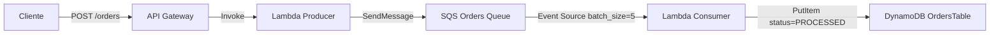

# Lab E-commerce SQS

Proyecto serverless de e-commerce construido con AWS CDK (Python) para procesar ordenes de forma asincrona usando API Gateway, Lambda, SQS y DynamoDB.

## Arquitectura



## Flujo funcional

1. El cliente envia `POST /orders` a API Gateway.
2. La Lambda `producer` valida datos, genera `orderId` y publica un mensaje en SQS.
3. API responde `202 Accepted` de inmediato (proceso asincrono).
4. La Lambda `consumer` es disparada por SQS, procesa mensajes y guarda la orden en DynamoDB con estado `PROCESSED`.

## Recursos creados por CDK

- `DynamoDB` tabla de ordenes (`orderId` como partition key, `PAY_PER_REQUEST`).
- `SQS` cola `ecommerce-orders-queue` (`visibility_timeout` de 30s).
- `Lambda` productora (`producer.handler`).
- `Lambda` consumidora (`consumer.handler`, timeout de 10s).
- `API Gateway` REST con endpoint `POST /orders`.

## Estructura del proyecto

```text
.
├── app.py
├── lab_ecomerce_sqs/
│   └── lab_ecomerce_sqs_stack.py
└── src/
    ├── producer.py
    └── consumer.py
```

## Requisitos

- Python 3.9+
- Node.js (version soportada por AWS CDK)
- AWS CDK CLI instalado globalmente
- Credenciales AWS configuradas en tu entorno

## Instalacion y despliegue

```bash
python3 -m venv .venv
source .venv/bin/activate
pip install -r requirements.txt
cdk synth
cdk deploy
```

## Prueba del endpoint

1. Obtiene la URL del API desde los outputs del deploy (`EcommerceOrdersApiEndpoint...`).
2. Ejecuta una solicitud:

```bash
curl -X POST "<API_ENDPOINT>/orders" \
  -H "Content-Type: application/json" \
  -d '{
    "customer": "Juan Perez",
    "item": "Teclado mecanico",
    "quantity": 1
  }'
```

Respuesta esperada: `202 Accepted` con `orderId` y `sqsMessageId`.

## Comandos utiles

- `cdk ls`: lista stacks.
- `cdk synth`: genera template de CloudFormation.
- `cdk diff`: muestra diferencias respecto al stack desplegado.
- `cdk deploy`: despliega infraestructura.
- `cdk destroy`: elimina recursos del stack.
